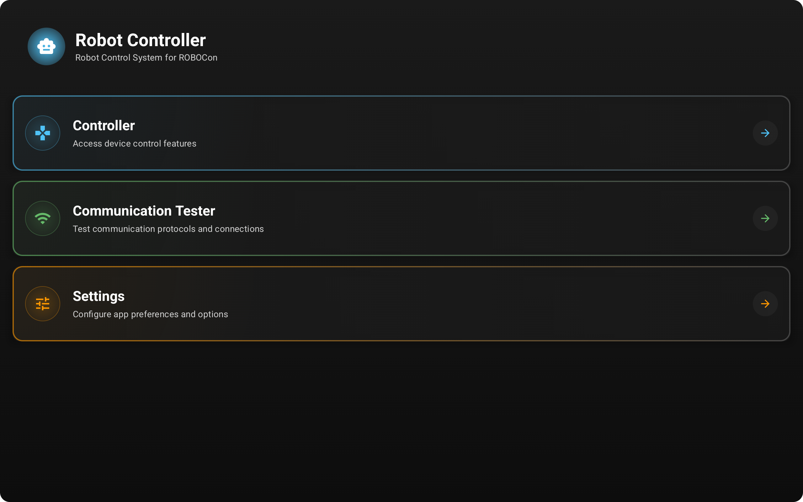
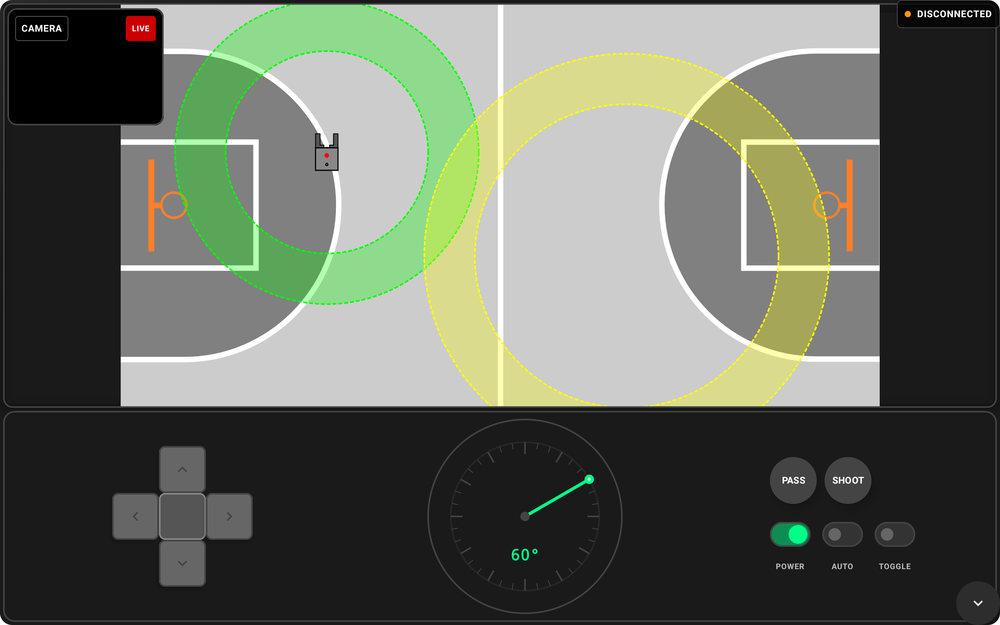
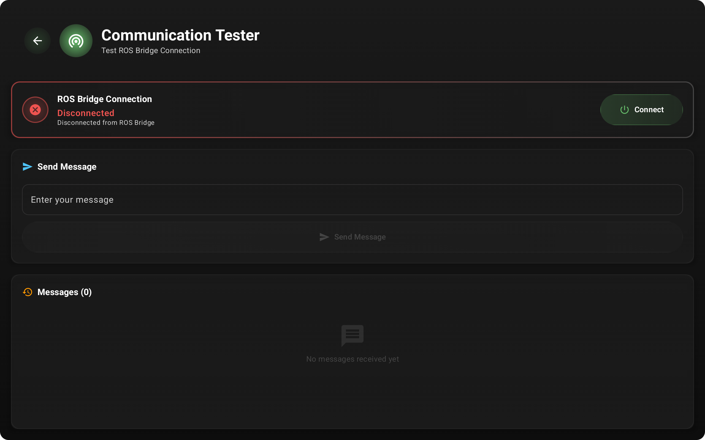
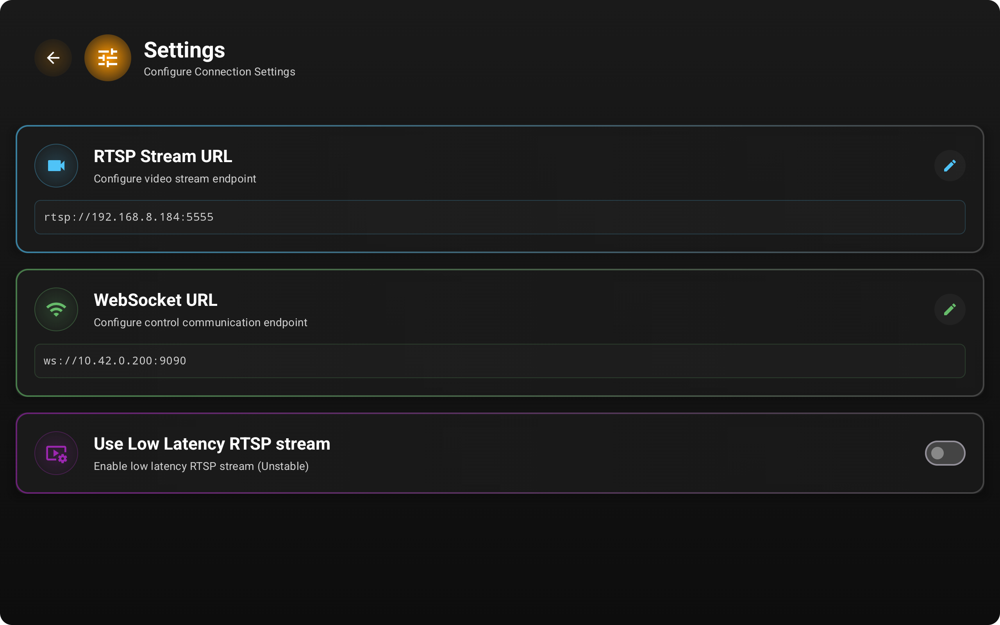

# Robot Controller

An Android application for controlling robots via ROS 2 through a ROS bridge connection. The app provides comprehensive robot control capabilities with live arena visualization, camera streaming, and customizable control interfaces.

## Features

### 🤖 Robot Control
- **ROS 2 Integration**: Connect to robots through ROS bridge using WebSocket
- **Multiple Control Interfaces**: 
  - Joystick control for precise movement
  - D-pad for directional commands
  - Angle controls for rotation adjustments
  - Switches and buttons for various robot functions
- **Custom ROS Bridge Library**: Built-in WebSocket client for ROS bridge communication

### 📺 Live Streaming & Visualization
- **Arena View**: Real-time visualization of the robot arena
- **Live Robot Tracking**: Display robot's current position within the arena
- **Camera Feed**: Live RTSP stream from robot's camera
- **Dual Video Players**: 
  - Default RTSP player
  - ExoPlayer option for improved stability over latency

### ⚙️ Customization
- **Configurable URLs**: Customize WebSocket and RTSP stream URLs
- **Settings Management**: Persistent user preferences
- **Flexible Streaming**: Switch between different video players based on network conditions

### 🚀 Future Enhancements
- **Machine Learning Integration**: Custom Rust-based ML model library for enhanced robot control assistance (in development)

## Technical Architecture

- **Language**: Kotlin with Jetpack Compose
- **ROS Communication**: Custom WebSocket implementation for ROS bridge
- **Streaming**: RTSP with multiple player backends
- **UI Framework**: Modern Android UI with Compose
- **Architecture Pattern**: MVVM with ViewModels
- **Native Libraries**: Rust integration for ML computations

## Key Components

### ROS Bridge Communication
- WebSocket-based connection to ROS bridge
- Support for ROS 2 message types
- Real-time bidirectional communication
- Service calls and topic subscriptions

### Control Systems
- Touch-based joystick controls
- Physical controller support
- Customizable control mappings
- Real-time command transmission

### Arena Visualization
- Canvas-based arena rendering
- Live robot position updates
- Interactive map interface
- Coordinate system mapping

## Screenshots

<details>
<summary>Click to view screenshots</summary>

<div align="center">
  
  
</div>

<div align="center">
  
  
</div>

</details>

## Getting Started

### Prerequisites
- Android Studio Arctic Fox or later
- Android SDK (API level 21+)
- ROS 2 environment with ros2-web-bridge
- Robot with ROS 2 nodes and camera stream

### Building the App
1. Clone the repository
2. Open in Android Studio  
3. Sync Gradle dependencies
4. Build and run on Android device

### Configuration
1. Launch the app
2. Navigate to Settings
3. Configure WebSocket URL for ROS bridge connection
4. Set RTSP stream URL for camera feed
5. Choose preferred video player (default or ExoPlayer)

### Connecting to Robot
1. Ensure ROS bridge is running on your robot/server
2. Connect to the same network as your robot
3. Use the configured WebSocket URL to establish connection
4. Start controlling your robot through the intuitive interface

## Project Structure

```
app/src/main/java/top/suhasdissa/robotcontroller/
├── components/          # UI components (Joystick, D-pad, Arena, etc.)
├── data/               # Data models and ROS message definitions
├── lib/                # Native library interfaces
├── rosutil/            # ROS bridge communication utilities
├── ui/                 # Screen compositions and navigation
├── util/               # Utilities and preferences
└── viewmodels/         # MVVM ViewModels
```

## Contributing

Contributions are welcome! Please feel free to submit issues, feature requests, or pull requests.

## License

This project is licensed under the GNU General Public License v3.0 - see the [LICENSE](LICENSE) file for details.

### GPLv3 License Summary
This program is free software: you can redistribute it and/or modify it under the terms of the GNU General Public License as published by the Free Software Foundation, either version 3 of the License, or (at your option) any later version.

This program is distributed in the hope that it will be useful, but WITHOUT ANY WARRANTY; without even the implied warranty of MERCHANTABILITY or FITNESS FOR A PARTICULAR PURPOSE. See the GNU General Public License for more details.